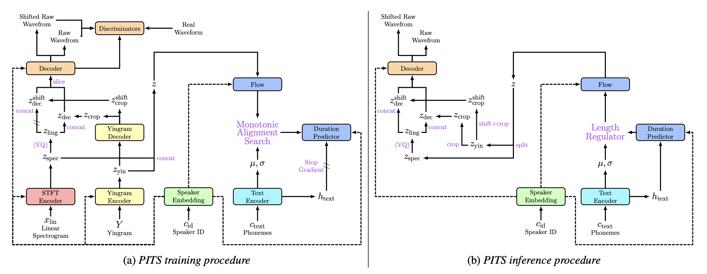

# PITS
**PITS: Variational Pitch Inference without Fundamental Frequency for End-to-End Pitch-controllable TTS**

**Abstract**: Previous pitch-controllable text-to-speech (TTS) models rely on directly modeling fundamental frequency, leading to low variance in synthesized speech. To address this issue, we propose PITS, an end-to-end pitch-controllable TTS model that utilizes variational inference to model pitch. Based on VITS, PITS incorporates the Yingram encoder, the Yingram decoder, and adversarial training of pitch-shifted synthesis to achieve pitch-controllability. Experiments demonstrate that PITS generates high-quality speech that is indistinguishable from ground truth speech and has high pitch-controllability without quality degradation. Code and audio samples will be available at https://github.com/anonymous-pits/pits.

**Training code is uploaded.**

**Demo and Checkpoint are uploaded at** [Hugging Face Space](https://huggingface.co/spaces/anonymous-pits/pits)🤗

Audio samples are uploaded at [github.io](https://anonymous-pits.github.io/pits/).

For the pitch-shifted Inference, we unify to use the notation in scope-shift, s, instead of pitch-shift.

Preprint version contains some errors! Please wait for the update!

 

README IS WIP...

## Requiremetns
- [Pytorch>=1.7.0](https://pytorch.org/) for [alias-free-torch](https://github.com/junjun3518/alias-free-torch) and [phaseaug](https://github.com/mindslab-ai/phaseaug)
- The requirements are highlighted in [requirements.txt](./requirements.txt).
- We also provide docker setup [Dockerfile](./Dockerfile).
```
docker build -t=pits .
```

### For VCTK
- Download VCTK (version 0.92) at [link](https://datashare.ed.ac.uk/handle/10283/3443)
- Resample files to `22050 Hz`, `16 bit`, `.wav` format.

### For custom dataset
- Resample files to `22050 Hz`, `16 bit`, `.wav` format.
- Check [configs/config\_en.yaml](configs/config_en.yaml) and change data section (e.g. path, files, speakers).
- To utilize a different phoneme set, you will need to modify the Python files located in the `text` folder.

## Training
- Run `train.py`, check [train.py](train.py) for detailed options.
```python 
python train.py -c configs/config_en.yaml -m {MODEL_NAME} {-i:if you change yingram setup or etc}
```

## Demo
**Demo and Checkpoint are uploaded at** [Hugging Face Space](https://huggingface.co/spaces/anonymous-pits/pits)🤗

We are currently working in progress to make dockerfile for local demo. Please wait for it.

## References
- Official VITS Implementation: https://github.com/jaywalnut310/vits
- NANSY Implementation from dhchoi99: https://github.com/dhchoi99/NANSY
- Official Avocodo Implementation: https://github.com/ncsoft/avocodo
- Official PhaseAug Implementation: https://github.com/mindslab-ai/phaseaug
- Tacotron Implementation from keithito: https://github.com/keithito/tacotron
- CSTR VCTK Corpus (version 0.92): https://datashare.ed.ac.uk/handle/10283/3443
- G2P for demo, g2p\_en from Kyubyong: https://github.com/Kyubyong/g2p
